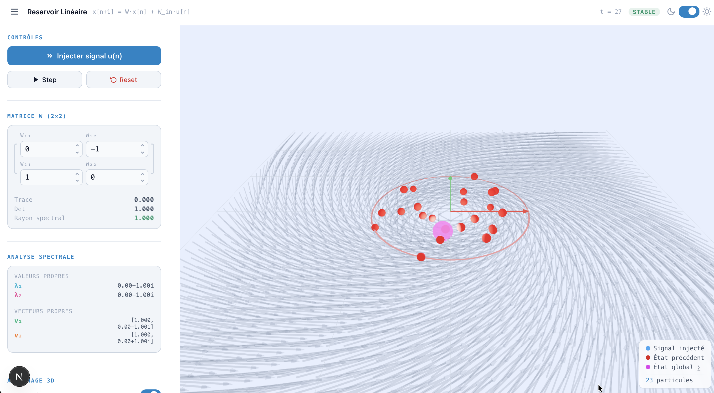

Voici un modèle de README clair, concis et structuré pour ton projet. Il met en avant les fonctionnalités mathématiques et 3D de ton code, tout en laissant l'emplacement parfait pour ta capture d'écran.

---

# 🌊 Reservoir Linear Viz

Une application interactive et pédagogique en 3D permettant de visualiser le comportement d'un système dynamique de type "réservoir linéaire" (concept clé du *Reservoir Computing*). L'outil offre une représentation visuelle en temps réel de l'évolution des états et de l'analyse spectrale d'une matrice de transformation.




## ✨ Fonctionnalités

* **Simulation Dynamique :** Visualisez l'équation `x[n+1] = W·x[n] + W_in·u[n]` pas à pas en injectant un signal ou en laissant le système évoluer.
* **Contrôle Matriciel en Temps Réel :** Modifiez la matrice de poids `W` (2×2) et observez instantanément l'impact sur le système.
* **Analyse Spectrale :** Calcul automatique et affichage de la trace, du déterminant, du rayon spectral, ainsi que des valeurs et vecteurs propres (réels et complexes).
* Champ de vecteurs dynamique.
* Cercle d'unité de stabilité.
* Particules représentant les états avec traînées.
* Affichage paramétrable des axes, colonnes de matrice et vecteurs propres.


* **Interface Réactive :** Thème clair/sombre et panneau latéral rétractable pour maximiser l'espace de la toile 3D.

## 🛠️ Stack Technique

* **Framework :** React / Next.js
* **3D / Rendu :** Three.js, @react-three/fiber, @react-three/drei
* **Styling :** CSS-in-JS 

## 🚀 Installation & Démarrage

1. **Cloner le projet** et naviguer dans le dossier :
```bash
cd ReservoirViz/reservoir-viz

```


2. **Installer les dépendances :**
```bash
npm install

```


3. **Lancer le serveur de développement :**
```bash
npm run dev

```


4. **Ouvrir l'application :**
Rendez-vous sur [http://localhost:3000](https://www.google.com/search?q=http://localhost:3000) dans votre navigateur pour explorer la visualisation.

## 🎮 Comment l'utiliser ?

1. Utilisez le panneau de gauche pour ajuster les valeurs de la matrice de poids **W**.
2. Observez la jauge de stabilité : si le rayon spectral (ρ) dépasse 1, le système devient instable.
3. Cliquez sur **Injecter signal u(n)** pour introduire de nouvelles particules dans le système.
4. Utilisez la souris sur la toile 3D pour pivoter, zoomer et explorer les vecteurs propres et l'espace de phase sous différents angles.